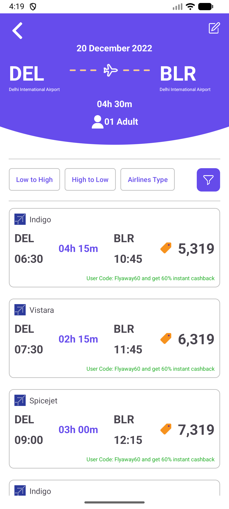
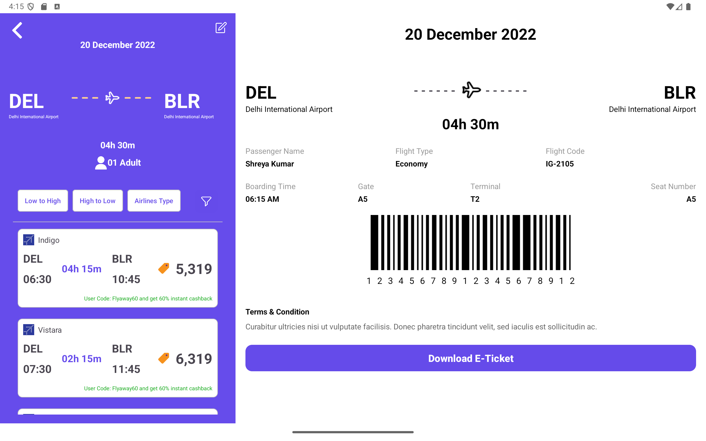

---

## ✈️ IndiGo

Une application Android élégante qui affiche les vols disponibles entre différentes villes avec une interface moderne et fluide.
Appuie sur un vol pour consulter instantanément tous ses détails.

# 🌟 Fonctionnalités

**🧭 Liste des vols** – Affiche une liste défilante de vols avec le nom de la compagnie, les horaires de départ et d’arrivée, la durée et le prix.

**🪄 Cartes interactives** – Chaque vol est cliquable et ouvre une vue détaillée.

**📄 Navigation par fragments** – Transition fluide entre la liste des vols et la page de détails.

**🎨 Design moderne** – Interface claire et responsive respectant les principes de Material Design.

**⚡ Code modulaire** – Architecture propre utilisant RecyclerView, ViewHolder et une interface personnalisée pour la gestion des clics.

# 🛠️ Stack technique
Catégorie	Technologie
Langage	Kotlin
Architecture	Basée sur Fragments / Navigation
Composants UI	RecyclerView, Fragments, TextView
Système de build	Gradle
Bibliothèques	AndroidX, Fragment KTX (optionnel), Material Components

# 📱 Captures d’écran

